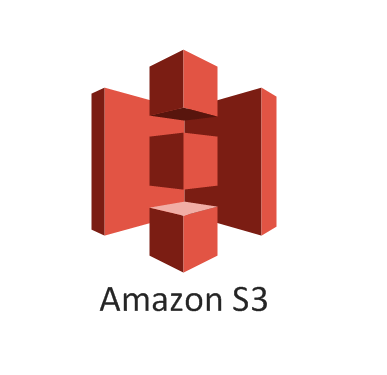

# Data Warehouse with AWS

## Motivation
This project is the hands-on project provided by udacity data engineering nanodegree. We have original event log data and songs data storing inside AWS S3 storage, it is our goal to stage the table in Redshift and conduct data transformation to obtain target star schema structure in Redshift.

## Introduction
There are two main source of data in this project. The first one is song_data that containing all the information of available songs within Sparkify system. The other is log data that preserves all user activities. 

The first step is to connect to S3 storage and stage the table to Redshift. Second step is to apply SQL insert command along with some data manipulation (join or group by) to complete our tables within Redshift. The final structure will be like a star schema with fact table listing songplay events as well as dimensional table containing specific information about artist, user, time and songs.

## Data Processing 
Below lists the detailed data processing procedure in this project

1. Fill out configuration file to ensure connection ability.
2. Complete SQL queries within sql_queries.py (includes DROP, CREATE, staging COPY and INSERT)
3. Run create_tables.py to drop old tables if exists and create tables according to desired schema.
4. Run etl.py to first connect to S3 storage and stage the table to Redshift.
5. Then insert columns to to our tables in Redshift with proper data manipulation (JOINs, GROUP BY and timestamp handling).
6. Check our results in Redshift console.

## Schema of Tables

Below is the diagram of schemas and structure of this project  

### Staging Tables

- **Staging_Events: Records of all activities**  
*event_id,artist,auth,firstName text, gender text, itemInSession int, lastName text, length float, level text, location text, method, page, registration, sessionId, song, status, ts, userAgent, userId*

- **Staging_Songs: Records of all songs** 
*num_songs, artist_id, artist_latitude, artist_longitude, artist_location, artist_name, song_id, title, duration, year*

### Redshift Tables 

- **songplays (fact table): Records in event data associated with song plays**  
*songplay_id, start_time, user_id, level, song_id, artist_id, session_id, location, user_agent*

- **users (dimension table): Users in the app**  
*user_id, first_name, last_name, gender, level*

- **songs (dimension table): Songs in music database**  
*song_id, title, artist_id, year, duration*

- **artists (dimension table): Artists in music database**  
*artist_id, name, location, lattitude, longitude*

- **time (dimension table): Timestamps of records in songplays broken down into specific units**  
*start_time, hour, day, week, month, year, weekday*

## Libraries Used 
- psycopg2 (to interact with Redshift)

## Files and Folders
- create_tables.py (Initiate database with desired tables and schema)
- sql_queries.py (Collections of DROP, CREATE TABLE, INSERT and some other queries)
- etl.py (Staging events and songs table as well as inserting columns to Redshift tables)
- dwh.cfg (Configuration file containing information of IAM_ROLE and connection to S3 and Redshift cluster.

## Summary
We are able to stage events and songs table from S3 storage to Redshift. After that, we successfully create star schema fact (songplays) and dimensional tables(Users, Artists, Songs and Time) in Redshift through proper SQL commands.

## Acknowledgement
Special thanks to udacity for providing required training, data source and resource to complete the project.
